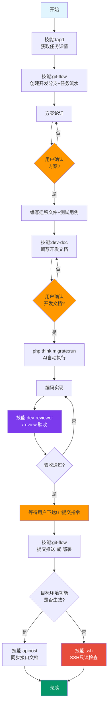

---
alwaysApply: true
---
# PHP后端需求开发流程

## 工作流程



**门控规则**：橙色节点必须用户明确同意后才能继续。**严禁跳过门控节点自动推进。**

## 触发关键词

开始任务、做任务、开发任务、开始开发、任务开发、提供任务ID

## 任务流水

每个任务在 `ai_cache/task-log/` 下维护子目录，用于跨会话恢复上下文。命名与开发文档一致：`{YYYYMMDD}-{需求中文名}-{分支名}`

```
ai_cache/task-log/
└── 20260506-异常报告优化-1011489-abnormal-report-optimize/
    ├── flow.md              ← 项目流水
    └── test-cases.json      ← 接口测试用例
```

**flow\.md 格式**：

```markdown
# {需求名称}

## 基本信息

| 字段 | 值 |
|------|-----|
| 任务ID | TAPD任务ID |
| 任务名称 | 任务名称 |
| 需求ID | 关联需求ID |
| 需求名称 | 需求名称 |
| 开发分支 | feature/xxx |
| 工作区 | rmp-api-{a/b/c} |
| 本地域名 | rmp-api-{a/b/c}.me |
| 所属项目 | rmp-api |
| 开发文档 | docs/{命名}.md |
| 测试用例 | task-log/{命名}/test-cases.json |
| 状态 | 开发中 / 测试中 / 已完成 |

## 流水记录

### YYYY-MM-DD

| 时间 | 步骤 | 详情 |
|------|------|------|
| - | 创建分支 | feature/xxx |
| - | 方案论证 | 改动概述 |
| - | 编写开发文档 | 涉及的Story |
| - | 编码完成 | 涉及文件清单 |
| - | 验收 | 通过/失败数 |
| - | 部署到dev | 合并结果 |
```

- **创建时机**：获取任务详情后、创建分支时同步创建目录和 flow\.md
- **更新时机**：每个关键节点完成时在 flow\.md 追加流水记录
- **恢复上下文**：新会话说"继续做 1011489" → 读取对应 flow\.md

## 补充约束

- **任务开发**：先创建分支再进入公共流程，分支名从TAPD任务ID中提取7位短ID：`feature/{短taskID}-{描述}`
- **方案论证**：必须先查看前端页面精准定位接口地址（先 `git pull`），再分析后端代码和数据库
- **调试思维**：多打断点看代码执行是否符合预期，不要单纯靠推理
