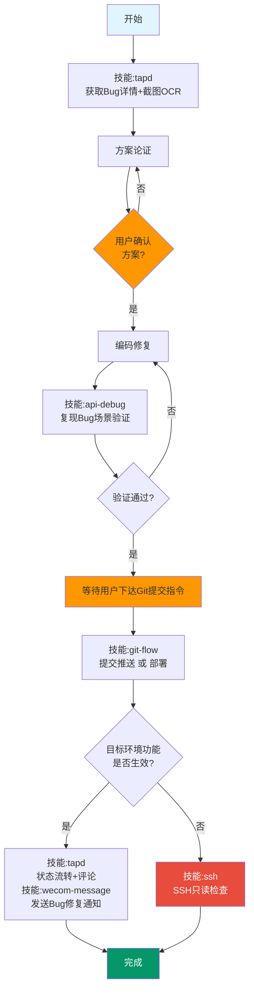

# Bug 修复流程

[系统级互斥锁] 严禁与其他重型技能并行执行。

## 工作流程

**门控规则**：橙色节点必须用户明确同意后才能继续。**严禁跳过门控节点自动推进。**

## 流程说明

### Step 1: 获取 Bug 详情

- 用户提供 Bug ID → 直接查询详情
- 用户未提供 ID → 调用 `tapd` 技能查询当前用户待处理的 Bug，取第一个处理
- **必须看截图**：从 Bug 描述中提取图片路径 → `get_image` 获取下载链接 → OCR 识别截图内容
- **必须看账号**：Bug 描述中的测试账号和密码，后续验证时必须使用该账号

### Step 2: 方案论证

- **先定位再出方案**：从前端代码入手找到调用的后端接口，再分析后端代码定位问题根因
- 输出修复方案，等待用户确认

### Step 3: 编码修复

- 按方案修复代码（最小改动原则）
- 语法检查 `php -l`

### Step 4: 验证修复

- 调用 `api-debug` 技能，**复现 Bug 描述的场景**，确认问题已解决
- **环境要求**：Bug 在哪个环境提的，就在哪个环境验证。切 `.env` 指向对应数据库
- **账号要求**：优先使用 Bug 描述中的测试账号，不要用默认账号
- 验证完成后**务必将 `.env` 切回开发环境**

### Step 5: 提交部署

等待用户下达 Git 提交指令后，调用 `git-flow` 提交推送或部署。

### Step 6: 状态流转 + 通知

- 调用 `tapd` 更新状态为"已解决"，处理人转回 reporter
- 添加修复评论（格式：修复内容/问题原因/解决方案/验证结果）
- 调用 `wecom-message` 发送 Bug 修复通知给测试人员

### Step 7: 记忆记录（不可跳过）

Bug 修复完成后，必须调用 `memory-manage` 技能回顾本次修复：
1. 有没有踩坑（调试发现意外根因）？→ 写入 daily
2. 有没有发现新的业务规则？→ 写入 daily
3. 有没有绕弯路才找到正确做法？→ 写入 daily

## 约束

- **一次只处理一个 Bug**
- **方案论证必须先定位再出方案**，不要上来就改代码
- **验证必须用 Bug 描述中的账号**，不要用默认账号
- **验证必须在 Bug 所在环境进行**，不要用开发环境替代测试环境
- **每个步骤都必须执行，严禁跳步**

## 触发关键词

改bug、修bug、修复bug、排查bug、fix bug、提供缺陷ID
