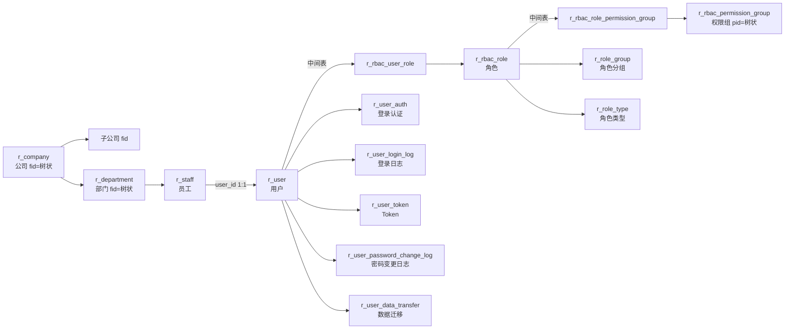

# 用户体系（User / RBAC）

| 表 | 用途 | 核心外键 |
|---|------|---------|
| r_company | 公司（树状，fid上级，relation_chain路径链） | fid |
| r_department | 部门（树状，fid上级） | company_id, fid, director_id |
| r_staff | 员工（用户的组织身份） | user_id, company_id, department_id, superior_id |
| r_user | 用户 | company_id |
| r_user_auth | 登录认证（账号密码token） | user_id |
| r_rbac_user_role | 用户-角色中间表（多对多） | user_id, role_id |
| r_rbac_role | 角色 | type(admin/普通), data_range, own(总公司/分公司) |
| r_rbac_role_permission_group | 角色-权限组中间表（多对多） | role_id, permission_group_id |
| r_rbac_permission_group | 权限组（树状，pid上级，类型：菜单/按钮/权限） | pid |
| r_role_group | 角色分组 | — |
| r_role_type | 角色类型 | — |
| r_user_login_log | 用户登录日志 | user_id |
| r_user_token | 用户Token | user_id |
| r_user_password_change_log | 密码变更日志 | user_id |
| r_user_data_transfer | 数据迁移记录 | user_id |
| r_organization_code | 组织编码（树状） | parent_organization_code |
