# 客户管理（Customer / CRM）

```mermaid
flowchart TB
    subgraph 线索阶段
        CLUE[r_customer_clue<br/>线索] -->|跟进| FOLLOW[r_customer_clue_follow<br/>跟进记录]
        FOLLOW --> REPLY[r_customer_clue_follow_reply<br/>回复]
        CLUE --> LAYER[r_customer_clue_layer<br/>分层信息]
        CLUE --> LOG[r_customer_clue_log<br/>线索日志]
        CLUE --> MAIL[r_customer_clue_mail_record<br/>邮寄记录]
        CLUE --> CANCEL[r_customer_clue_cancel<br/>作废申请]
    end

    subgraph 转化签约
        CLUE -->|转化| CUSTOMER[r_customer<br/>客户主表]
        CUSTOMER -->|1:1| SALESMAN[r_customer_salesman_contact<br/>销售代表]
        CUSTOMER -->|1:1| MARKET[r_customer_marketing_user<br/>市场经理]
        CUSTOMER -->|多人| CONTACT[r_customer_contact_person<br/>联系人]
        CUSTOMER -->|多个| CHANGDI[r_customer_changdi<br/>场地]
        CUSTOMER -->|多个| SUB[r_customer_subcompany<br/>子公司]
        CUSTOMER -->|1:1| SURVEY[r_customer_survey_info<br/>调研信息]
        CUSTOMER -->|审批通过| STOREHOUSE[r_storehouse<br/>自动建仓库]
        CUSTOMER -->|意向协议| INTENTION[r_customer_intention_agreement<br/>意向协议]
    end

    subgraph 场地运营人员
        CHANGDI --> GROUND_OP[r_customer_ground_operator_contact<br/>场地运营]
        CHANGDI --> GROUND_MGR[r_customer_ground_operator_manager_contact<br/>场地运营主管]
    end

    subgraph 变更日志
        CUSTOMER --> LOG_S[r_log_customer_salesman_change<br/>销售代表变更]
        CUSTOMER --> LOG_PM[r_log_customer_project_manager_change<br/>销售助理变更]
        CUSTOMER --> LOG_G[r_log_customer_ground_operator_change<br/>场地运营变更]
        CUSTOMER --> LOG_ST[r_log_customer_status_change<br/>客户状态变更]
        CUSTOMER --> LOG_NEW[r_customer_new_status_log<br/>新状态日志]
    end

    subgraph 客户池流转
        CLUE --> POOL[r_customer_pool_flow_log<br/>客户池流转日志]
        CUSTOMER --> DRAFT[r_customer_info_draft<br/>客户信息草稿]
    end

    subgraph 跟进申请
        CLUE --> DEFER[r_customer_follow_defer_apply<br/>延期申请]
        CLUE --> CONTRACT_APPLY[r_customer_follow_contract_apply<br/>签约申请]
        CLUE --> INTENT_APPLY[r_customer_intention_agreement_apply<br/>意向协议申请]
    end

    subgraph 审批调查
        CUSTOMER --> APPROVE_SURVEY[r_approve_customer_survey_time<br/>调查时间审批]
        CUSTOMER --> PM_ASSIGN[r_customer_project_manager_assign_approve<br/>项目经理分配审批]
    end
```

| 表 | 用途 | 核心外键 |
|---|------|---------|
| r_customer_clue | 线索（转化前状态） | customer_id, sale_user_id, company_id, pool_type |
| r_customer_clue_follow | 跟进记录 | clue_id, creator_user_id |
| r_customer_clue_follow_reply | 跟进回复 | follow_id, reply_id |
| r_customer_clue_layer | 线索分层（行业/工艺/产品） | clue_id |
| r_customer_clue_log | 线索日志（状态变更记录） | clue_id, customer_id, sale_user_id |
| r_customer_clue_mail_record | 邮寄记录 | clue_id, customer_id |
| r_customer_clue_cancel | 线索作废申请 | clue_id |
| r_customer | 客户主表 | company_id, clue_id |
| r_customer_contact_person | 联系人（多个） | customer_id, clue_id |
| r_customer_salesman_contact | 销售代表（1:1） | customer_id, salesman_user_id, company_id |
| r_customer_marketing_user | 市场经理（1:1） | customer_id, marketing_user_id, company_id |
| r_customer_changdi | 场地（多个） | customer_id, operator_manager_id |
| r_customer_subcompany | 客户子公司 | customer_id |
| r_customer_survey_info | 客户调研信息 | customer_id, investigator_user_id |
| r_customer_ground_operator_contact | 场地运营人员 | customer_id, customer_ground_id, operator_user_id |
| r_customer_ground_operator_manager_contact | 场地运营主管 | customer_id, customer_ground_id, operator_manager_user_id |
| r_customer_user_gl | 客户-用户关联 | customer_id, user_id |
| r_customer_changdi_robot_gl | 场地-机器人关联 | customer_id, customer_changdi_id, robot_id, work_station_id |
| r_customer_intention_agreement | 意向协议 | customer_id, sign_file_id |
| r_customer_intention_agreement_apply | 意向协议申请 | clue_id, customer_id |
| r_customer_follow_defer_apply | 延期申请 | clue_id, customer_id |
| r_customer_follow_contract_apply | 签约申请 | clue_id, customer_id |
| r_customer_info_draft | 客户信息草稿 | user_id, salesman_user_id |
| r_customer_pool_flow_log | 客户池流转日志 | customer_id, company_id, sale_user_id |
| r_customer_new_status_log | 客户新状态日志 | customer_id, operator_id |
| r_approve_customer_survey_time | 调查时间审批 | customer_id, initiator_user_id, cpm_user_id |
| r_customer_project_manager_assign_approve | 项目经理分配审批 | customer_id |
| r_log_customer_salesman_change | 销售代表变更日志 | customer_id, salesman_user_id, log_user_id |
| r_log_customer_project_manager_change | 销售助理变更日志 | customer_id, user_id |
| r_log_customer_ground_operator_change | 场地运营变更日志 | customer_id |
| r_log_customer_status_change | 客户状态变更日志 | customer_id |
| r_storehouse | 仓库（审批通过自动创建） | company_id, customer_id |
