# 工位管理（WorkStation）

```mermaid
flowchart TB
    subgraph 需求阶段
        CUSTOMER[r_customer] -->|提交需求| WSD[r_work_station_demand<br/>工位需求]
        WSD -->|审核通过<br/>自动生成| WST[r_work_station_template<br/>工位模板]
    end

    subgraph 工位阶段
        WST -->|手动创建| WS[r_work_station<br/>工位]
        WS -->|绑定方案| WSS[r_work_station_scheme<br/>工位方案]
        WS -->|部署机器人| RWSR[r_robot_work_station_relation<br/>机器人工位关联]
    end

    subgraph 方案子表
        WSS --> WSSEXT[r_work_station_scheme_ext<br/>方案扩展]
        WSS --> WSSCONS[r_work_station_scheme_consum<br/>耗材]
        WSS --> WSSDEVICE[r_work_station_scheme_custom_device<br/>自定义设备]
        WSS --> WSSDEMAND[r_work_station_scheme_custom_demand<br/>自定义需求]
        WSS --> WSSFIX[r_work_station_scheme_fixture<br/>夹具]
        WSS --> WSSHAND[r_work_station_scheme_hand_claws<br/>机械手]
        WSS --> WSSKEY[r_work_station_scheme_key_parameter<br/>关键参数]
        WSS --> WSSMODULE[r_work_station_scheme_module<br/>模块]
        WSS --> WSSPARAM[r_work_station_scheme_parameter<br/>参数]
        WSS --> WSSPRODUCT[r_work_station_scheme_product<br/>产品]
        WSS --> WSSRES[r_work_station_scheme_resource<br/>资源]
        WSS --> WSSRISK[r_work_station_scheme_risk<br/>风险]
        WSS --> WSSSELF[r_work_station_scheme_self_purchase_device<br/>自购设备]
        WSS --> WSSTABLE[r_work_station_scheme_table<br/>表格]
    end

    subgraph 通用方案
        UWSS[r_universal_work_station_scheme<br/>通用方案] --> UWSSEXT[r_universal_work_station_scheme_ext<br/>通用方案扩展]
    end

    subgraph 其他
        WS --> WSGROUP[r_work_station_group<br/>工位分组]
        WSGROUP --> WSGRECORD[r_work_station_group_record<br/>分组记录]
        WSGRECORD --> WSGDETAIL[r_work_station_group_detail_record<br/>分组明细]
        WS --> WSPEOPLE[r_work_station_personnel<br/>工位人员]
        WS --> WSPRODUCT[r_work_station_product<br/>工位产品]
        WS --> WSDEVICE_INV[r_work_station_device_inventory<br/>工位设备库存]
    end

    subgraph 日志
        WST --> WST_LOG[r_work_station_template_operate_log<br/>模板操作日志]
        WST --> WST_STATUS[r_work_station_status_change_log<br/>状态变更日志]
        WS --> WSS_FILE[r_work_station_scheme_file_list<br/>方案文件]
        WSS --> WSS_LOG[r_log_work_station_scheme_contact<br/>方案变更日志]
        WST --> WST_SCHEME_LOG[r_log_work_station_template_scheme_contact<br/>模板方案变更日志]
    end
```

| 表 | 用途 | 核心外键 |
|---|------|---------|
| r_work_station_demand | 工位需求 | customer_id, work_station_id |
| r_work_station_template | 工位模板（审核通过自动生成） | work_station_demand_id, customer_id |
| r_work_station | 工位 | customer_id, company_id, work_station_template_id, work_station_scheme_id |
| r_work_station_scheme | 工位方案（核心子表母表） | work_station_id |
| r_work_station_scheme_ext | 方案扩展信息 | work_station_scheme_id |
| r_work_station_scheme_consum | 方案耗材 | work_station_scheme_id |
| r_work_station_scheme_custom_device | 方案自定义设备 | work_station_scheme_id |
| r_work_station_scheme_custom_demand | 方案自定义需求 | work_station_scheme_id |
| r_work_station_scheme_fixture | 方案夹具 | work_station_scheme_id |
| r_work_station_scheme_hand_claws | 方案机械手 | work_station_scheme_id |
| r_work_station_scheme_key_parameter | 方案关键参数 | work_station_scheme_id |
| r_work_station_scheme_module | 方案模块 | work_station_scheme_id |
| r_work_station_scheme_parameter | 方案参数 | work_station_scheme_id |
| r_work_station_scheme_product | 方案产品 | work_station_scheme_id |
| r_work_station_scheme_resource | 方案资源 | work_station_scheme_id |
| r_work_station_scheme_risk | 方案风险 | work_station_scheme_id |
| r_work_station_scheme_self_purchase_device | 方案自购设备 | work_station_scheme_id |
| r_work_station_scheme_table | 方案表格 | work_station_scheme_id |
| r_work_station_scheme_file_list | 方案文件列表 | work_station_scheme_id |
| r_work_station_scheme_product_detail_record | 方案产品明细记录 | work_station_scheme_id |
| r_work_station_scheme_product_record | 方案产品记录 | work_station_scheme_id |
| r_universal_work_station_scheme | 通用工位方案 | — |
| r_universal_work_station_scheme_ext | 通用方案扩展 | universal_work_station_scheme_id |
| r_robot_work_station_relation | 机器人工位关联 | robot_id, work_station_id |
| r_work_station_group | 工位分组 | — |
| r_work_station_group_record | 分组记录 | work_station_group_id |
| r_work_station_group_detail_record | 分组明细 | work_station_group_record_id |
| r_work_station_personnel | 工位人员 | work_station_id, user_id |
| r_work_station_product | 工位产品 | work_station_id |
| r_work_station_device_inventory | 工位设备库存 | work_station_id, material_id |
| r_work_station_union_product | 工位联合产品 | — |
| r_work_station_work_time | 工位工时 | work_station_id |
| r_work_station_template_operate_log | 模板操作日志 | work_station_template_id |
| r_work_station_status_change_log | 状态变更日志 | work_station_id |
| r_work_station_template_status_summary | 模板状态汇总 | work_station_template_id |
| r_work_station_template_status_delay_log | 模板状态延期日志 | work_station_template_id |
| r_log_work_station_scheme_contact | 方案变更日志 | work_station_scheme_id |
| r_log_work_station_template_scheme_contact | 模板方案变更日志 | work_station_template_id |
