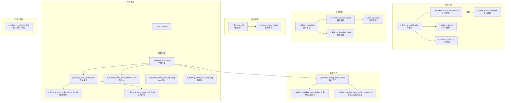

# 交付管理（Delivery）

| 表 | 用途 | 核心外键 |
|---|------|---------|
| r_delivery_month_plan | 月交付计划 | company_id |
| r_delivery_month_plan_history | 月计划历史 | month_plan_id, work_station_template_id |
| r_delivery_target | 交付目标 | company_id, user_id |
| r_delivery_plan_log | 计划日志 | template_id, creator_id |
| r_delivery_template | 交付模板 | — |
| r_delivery_template_detail | 模板明细 | template_id, node_id |
| r_delivery_template_front | 模板前端配置 | template_id |
| r_delivery_node | 交付节点 | — |
| r_delivery_task | 任务定义 | — |
| r_delivery_task_matter | 任务事项 | task_id |
| r_delivery_work_order | 交付工单（从工位发起） | work_station_id, customer_id, company_id |
| r_delivery_work_order_task | 工单任务 | work_order_id, task_id |
| r_delivery_work_order_task_material | 任务物料 | work_order_task_id, material_id |
| r_delivery_work_order_task_front | 任务前端 | work_order_task_id |
| r_delivery_work_order_confirm_user | 确认人 | work_order_id, user_id |
| r_delivery_work_order_pmc_log | PMC日志 | work_order_id |
| r_delivery_work_order_stop_log | 停线日志 | work_order_id |
| r_delivery_analog_work_station | 模拟工位 | work_order_id, company_id |
| r_delivery_analog_work_station_order | 模拟工位工单 | analog_work_station_id, work_order_id |
| r_delivery_analog_work_station_status_log | 模拟工位状态日志 | analog_work_station_id |
| r_delivery_customer_field | 客户自定义字段 | — |
