# 机器人管理（Robot）

```mermaid
flowchart TB
    ROBOT[r_robot<br/>机器人主表] --> RWSR[r_robot_work_station_relation<br/>工位关联]
    ROBOT --> RDATA[r_robot_data<br/>机器人数据]
    ROBOT --> RSETTLE[r_robot_data_settle<br/>数据结算]
    ROBOT --> RDSWAIT[r_robot_daily_settlement_wait<br/>日结算等待]
    ROBOT --> RHARD[r_robot_hardware<br/>硬件]
    ROBOT --> RIDENT[r_robot_identification<br/>标识]
    ROBOT --> RPROG[r_robot_program<br/>程序]
    ROBOT --> RCOMP[r_robot_company_contact<br/>公司关联]
    ROBOT --> RDATAWS[r_robot_data_work_station<br/>数据工位]

    subgraph 版本管理
        ROBOT --> RVERSION_B[r_robot_version_big<br/>大版本]
        ROBOT --> RVERSION_S[r_robot_version_small<br/>小版本]
        ROBOT --> RCOMMAND[r_robot_command<br/>指令]
    end

    subgraph 告警
        ROBOT --> RWARN[r_warning_data<br/>告警数据]
        ROBOT --> RLOGOP[r_log_robot_operation<br/>操作日志]
        RLOGOP --> RLOGERR[r_log_robot_operation_error<br/>操作错误日志]
    end

    subgraph 设备记录
        ROBOT --> DEV_BAT[r_device_record_battery<br/>电池记录]
        ROBOT --> DEV_LOC[r_device_record_location<br/>定位记录]
        ROBOT --> DEV_PWR[r_device_record_power_warning<br/>电量告警]
    end

    subgraph 变更日志
        RSETTLE --> LOG_COMP[r_log_robot_company_change<br/>公司变更日志]
        RSETTLE --> LOG_GROUND[r_log_robot_customer_ground_change<br/>场地变更日志]
    end

    subgraph 产品标识
        PRODUCT[r_product<br/>产品] --> PIC[r_product_identification_code<br/>产品标识码]
    end
```

| 表 | 用途 | 核心外键 |
|---|------|---------|
| r_robot | 机器人主表 | company_id, customer_id |
| r_robot_work_station_relation | 机器人工位关联 | robot_id, work_station_id |
| r_robot_data | 机器人采集数据 | robot_id |
| r_robot_data_work_station | 数据工位关联 | robot_id |
| r_robot_data_settle | 数据结算 | robot_id, customer_id |
| r_robot_daily_settlement_wait | 日结算等待 | robot_id |
| r_robot_hardware | 机器人硬件 | robot_id |
| r_robot_identification | 机器人标识 | robot_id |
| r_robot_program | 机器人程序 | — |
| r_robot_company_contact | 机器人公司关联 | robot_id |
| r_robot_version_big | 大版本 | — |
| r_robot_version_small | 小版本 | — |
| r_robot_command | 机器人指令 | — |
| r_warning_data | 告警数据 | robot_id |
| r_log_robot_operation | 操作日志 | robot_id |
| r_log_robot_operation_error | 操作错误日志 | robot_operation_id |
| r_device_record_battery | 电池记录 | robot_id |
| r_device_record_location | 定位记录 | robot_id |
| r_device_record_power_warning | 电量告警 | robot_id |
| r_device_debug_page | 设备调试页面 | — |
| r_log_robot_company_change | 公司变更日志 | robot_id |
| r_log_robot_customer_ground_change | 场地变更日志 | robot_id |
| r_product | 产品 | material_id |
| r_product_identification_code | 产品标识码 | product_id |
