# 物料管理（Material）

```mermaid
flowchart TB
    subgraph 物料主数据
        MAT[r_material<br/>物料主表] --> MGROUP[r_material_group<br/>物料分组]
        MAT --> MCONFIG[r_material_config<br/>物料配置]
        MAT --> MPRODUCT[r_material_product<br/>物料-产品关联]
        MAT --> MPRICE[r_material_price<br/>物料价格]
        MAT --> MBARCODE[r_material_barcode<br/>物料条码]
        MAT --> MVERSION[r_material_version<br/>物料版本]
        MAT --> MDOC[r_material_document<br/>物料文档]
        MDOC --> MDOCTYPE[r_material_document_type<br/>文档类型]
        MAT --> MDEMAND[r_material_demand<br/>物料需求]
        MAT --> MALERT[r_material_inventory_alert<br/>库存预警]
        MAT --> MMAINTE[r_material_maintenance_record<br/>维护记录]
        MMAINTE --> MMAINTE_REQ[r_material_maintenance_required_material<br/>维护所需物料]
        MAT --> MGITVER[r_material_gitlab_version<br/>GitLab版本]
    end

    subgraph 物料库存
        MAT --> MSTOCK[r_material_stock<br/>物料库存]
        MSTOCK --> MSTOCKDET[r_material_stock_detail<br/>库存明细]
        MSTOCKDET --> MSTOCKLOG[r_material_stock_detail_log<br/>库存变更日志]
        MSTOCKDET --> MSTOCKLOCK[r_material_stock_lock_log<br/>库存锁定日志]
    end

    subgraph 请购
        MREQ[r_material_request_order<br/>请购单] --> MREQDET[r_material_request_order_detail<br/>请购明细]
        MREQ --> MRDO[r_material_request_delivery_order<br/>请购发货单]
        MRDO --> MRDODET[r_material_request_delivery_order_detail<br/>发货明细]
    end

    subgraph 退料
        MRET[r_material_return_order<br/>退料单] --> MRETDET[r_material_return_order_detail<br/>退料明细]
        MRET --> MRTRDO[r_material_return_delivery_order<br/>退料发货单]
        MRTRDO --> MRTRDODET[r_material_return_delivery_order_detail<br/>退料发货明细]
    end
```

| 表 | 用途 | 核心外键 |
|---|------|---------|
| r_material | 物料主表 | material_group_id |
| r_material_group | 物料分组 | — |
| r_material_config | 物料配置 | material_id |
| r_material_product | 物料-产品关联 | material_id, product_id |
| r_material_price | 物料价格 | material_id |
| r_material_barcode | 物料条码 | material_id |
| r_material_version | 物料版本 | material_id |
| r_material_document | 物料文档 | material_id, material_document_type_id |
| r_material_document_type | 文档类型 | — |
| r_material_demand | 物料需求 | material_id, material_group_id |
| r_material_inventory_alert | 库存预警 | material_id |
| r_material_maintenance_record | 维护记录 | material_id |
| r_material_maintenance_required_material | 维护所需物料 | maintenance_record_id, material_id |
| r_material_gitlab_version | GitLab版本 | material_id |
| r_material_stock | 物料库存 | material_id, storehouse_id |
| r_material_stock_detail | 库存明细 | material_stock_id, material_id |
| r_material_stock_detail_log | 库存变更日志 | material_stock_detail_id |
| r_material_stock_lock_log | 库存锁定日志 | material_stock_detail_id |
| r_material_request_order | 请购单 | — |
| r_material_request_order_detail | 请购明细 | request_order_id, material_id |
| r_material_request_delivery_order | 请购发货单 | request_order_id |
| r_material_request_delivery_order_detail | 发货明细 | delivery_order_id, material_id |
| r_material_return_order | 退料单 | — |
| r_material_return_order_detail | 退料明细 | return_order_id, material_id |
| r_material_return_delivery_order | 退料发货单 | return_order_id |
| r_material_return_delivery_order_detail | 退料发货明细 | delivery_order_id, material_id |
| r_material_cost_detail_log | 物料成本明细日志 | material_id, storehouse_id |
