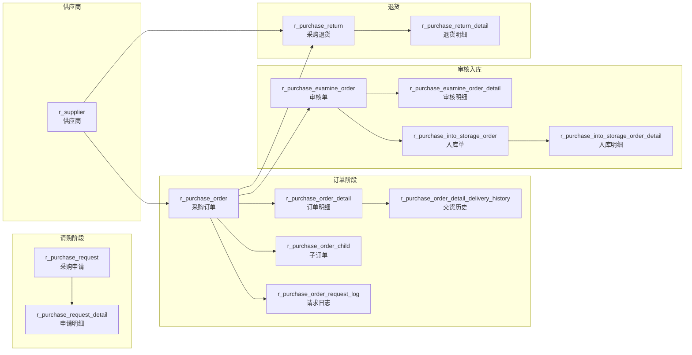

# 采购管理（Purchase）

| 表 | 用途 | 核心外键 |
|---|------|---------|
| r_purchase_request | 采购申请 | company_id |
| r_purchase_request_detail | 申请明细 | request_id, material_id |
| r_purchase_order | 采购订单 | supplier_id, company_id |
| r_purchase_order_detail | 订单明细 | order_id, material_id |
| r_purchase_order_child | 子订单 | order_id |
| r_purchase_order_detail_delivery_history | 交货历史 | order_detail_id |
| r_purchase_order_request_log | 请求日志 | order_id |
| r_purchase_examine_order | 审核单 | order_id |
| r_purchase_examine_order_detail | 审核明细 | examine_order_id |
| r_purchase_into_storage_order | 入库单 | examine_order_id, storehouse_id |
| r_purchase_into_storage_order_detail | 入库明细 | into_storage_order_id, material_id |
| r_purchase_return | 采购退货 | order_id |
| r_purchase_return_detail | 退货明细 | return_id, material_id |
| r_supplier | 供应商 | company_id |
