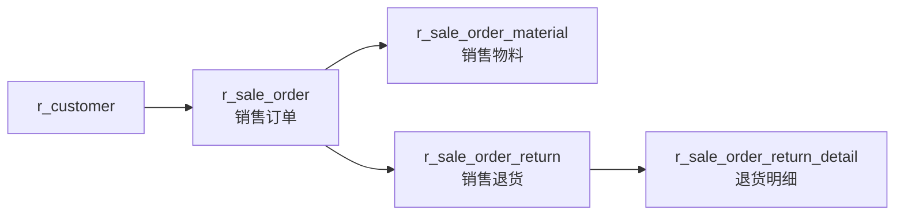

# 销售管理（Sale）

| 表 | 用途 | 核心外键 |
|---|------|---------|
| r_sale_order | 销售订单 | customer_id, company_id |
| r_sale_order_material | 销售物料 | sale_order_id, material_id |
| r_sale_order_return | 销售退货 | sale_order_id, customer_id |
| r_sale_order_return_detail | 退货明细 | return_id, material_id |
