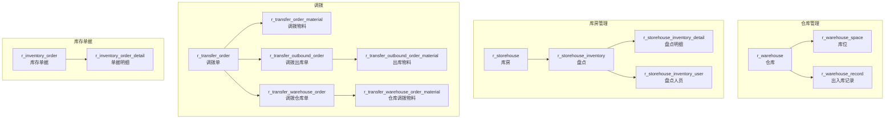

# 仓储物流（Warehouse / Storehouse / Transfer）

| 表 | 用途 | 核心外键 |
|---|------|---------|
| r_warehouse | 仓库 | company_id |
| r_warehouse_space | 库位 | warehouse_id |
| r_warehouse_record | 出入库记录 | warehouse_id |
| r_storehouse | 库房（审批通过自动创建） | company_id, customer_id |
| r_storehouse_inventory | 盘点 | storehouse_id |
| r_storehouse_inventory_detail | 盘点明细 | storehouse_inventory_id |
| r_storehouse_inventory_user | 盘点人员 | storehouse_inventory_id, user_id |
| r_transfer_order | 调拨单 | storehouse_id, company_id |
| r_transfer_order_material | 调拨物料 | transfer_order_id, material_id |
| r_transfer_outbound_order | 调拨出库单 | transfer_order_id |
| r_transfer_outbound_order_material | 出库物料 | outbound_order_id, material_id |
| r_transfer_warehouse_order | 调拨仓库单 | transfer_order_id |
| r_transfer_warehouse_order_material | 仓库调拨物料 | warehouse_order_id, material_id |
| r_inventory_order | 库存单据 | storehouse_id |
| r_inventory_order_detail | 单据明细 | inventory_order_id, material_id |
| r_fixture_order | 夹具订单 | customer_id, work_station_id |
| r_fixture_order_material | 夹具订单物料 | fixture_order_id, material_id |
