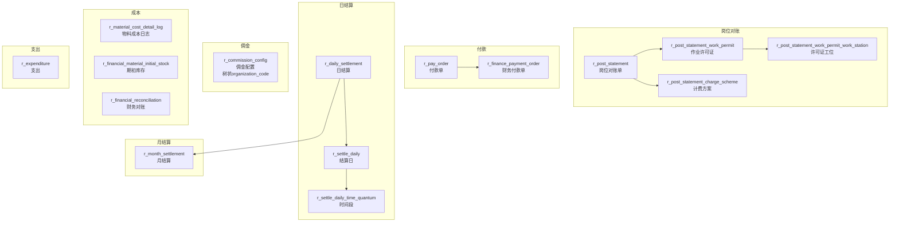

# 财务结算（Finance / Settlement）

| 表 | 用途 | 核心外键 |
|---|------|---------|
| r_post_statement | 岗位对账单 | customer_id, company_id |
| r_post_statement_work_permit | 作业许可证 | post_statement_id |
| r_post_statement_work_permit_work_station | 许可证工位 | work_permit_id, work_station_id |
| r_post_statement_charge_scheme | 计费方案 | post_statement_id |
| r_pay_order | 付款单 | purchase_order_id, supplier_id |
| r_finance_payment_order | 财务付款单 | pay_order_id, supplier_id |
| r_daily_settlement | 日结算 | work_station_id, robot_id, company_id |
| r_settle_daily | 结算日 | — |
| r_settle_daily_time_quantum | 时间段 | settle_daily_id |
| r_month_settlement | 月结算 | customer_id, company_id |
| r_commission_config | 佣金配置（树状） | parent_organization_code |
| r_material_cost_detail_log | 物料成本日志 | material_id, storehouse_id |
| r_financial_material_initial_stock | 期初库存 | material_id, material_group_id |
| r_financial_reconciliation | 财务对账 | — |
| r_expenditure | 支出 | company_id |
| r_robot_daily_settlement_wait | 机器人日结算等待 | robot_id |
