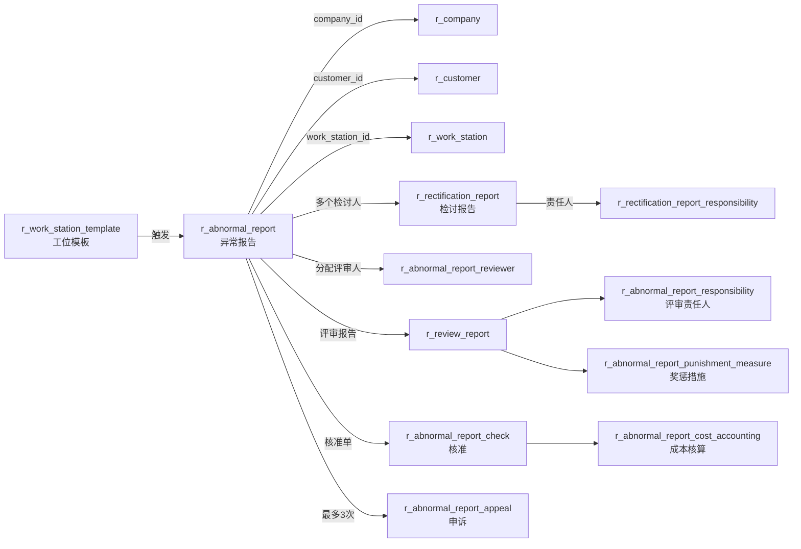

# 异常报告模块（Abnormal Report）

| 表 | 用途 | 核心外键 |
|---|------|---------|
| r_abnormal_report | 异常报告主表 | work_station_template_id, customer_id, work_station_id, company_id |
| r_rectification_report | 检讨报告（每个检讨人一条） | abnormal_report_id, filler_id |
| r_rectification_report_responsibility | 检讨责任人 | rectification_report_id, user_id, department_id |
| r_abnormal_report_reviewer | 评审人分配 | abnormal_report_id, user_id |
| r_review_report | 评审报告 | abnormal_report_id |
| r_abnormal_report_punishment_measure | 奖惩措施 | abnormal_report_id, check_report_id, user_id |
| r_abnormal_report_check | 核准单 | abnormal_report_id |
| r_abnormal_report_cost_accounting | 成本核算 | check_report_id, abnormal_report_id |
| r_abnormal_report_appeal | 申诉记录 | abnormal_report_id, appeal_user_id |
| r_abnormal_report_responsibility | 责任人 | abnormal_report_id, user_id, department_id |
