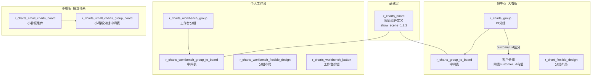

# 图表报表模块（Charts / BI）

| 表 | 用途 | 核心外键 |
|---|------|---------|
| r_charts_board | 图表组件定义（基建，三个业务共享） | show_scene(1=BI,2=工作台,3=客户) |
| r_charts_group | BI分组 + 客户分组（同表，customer_id区分） | customer_id, is_investor |
| r_charts_group_to_board | BI/客户 分组-图表中间表 | group_id, board_id |
| r_chart_flexible_design | BI/客户 分组布局 | group_id |
| r_charts_workbench_group | 工作台分组（独立） | — |
| r_charts_workbench_group_to_board | 工作台 分组-图表中间表 | group_id, board_id |
| r_charts_workbench_flexible_design | 工作台分组布局 | group_id |
| r_charts_workbench_button | 工作台按钮（工作台独有） | board_id |
| r_charts_small_charts_board | 小看板组件（独立于大看板） | — |
| r_charts_small_charts_group_board | 小看板分组中间表 | board_id |
