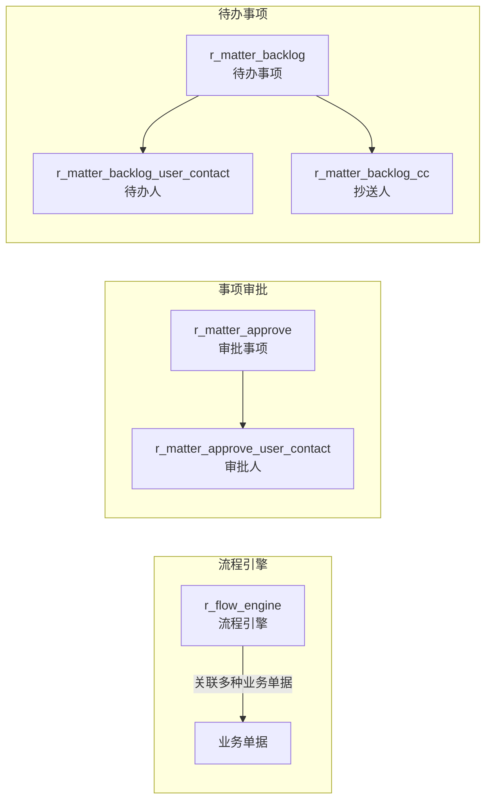

# 审批流程（Workflow）

| 表 | 用途 | 核心外键 |
|---|------|---------|
| r_matter_approve | 审批事项 | company_id |
| r_matter_approve_user_contact | 审批人 | matter_approve_id, user_id |
| r_matter_backlog | 待办事项 | company_id |
| r_matter_backlog_user_contact | 待办人 | matter_backlog_id, user_id |
| r_matter_backlog_cc | 抄送人 | matter_backlog_id, user_id |

> 流程引擎通过 `FlowEngineRepository` 关联多种业务单据：客户签约、意向协议、延期、付款、日/月结算、请购、退料、夹具等。
