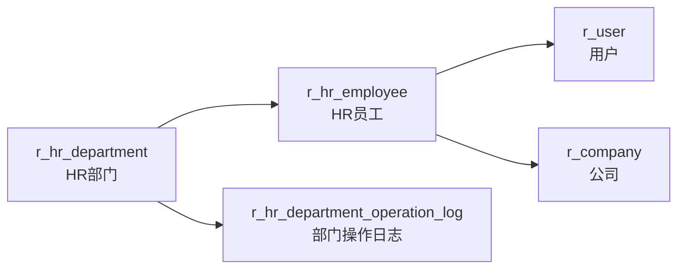

# 人力资源（HR）

| 表 | 用途 | 核心外键 |
|---|------|---------|
| r_hr_department | HR部门（树状） | fid |
| r_hr_department_operation_log | 部门操作日志 | hr_department_id |
| r_hr_employee | HR员工 | hr_department_id, user_id, company_id |
| r_attendance | 考勤 | user_id |
| r_attendance_algorithm_config | 考勤算法配置 | — |
| r_attendance_exclude_location | 考勤排除地点 | — |
| r_holiday_calendar | 节假日日历 | — |
