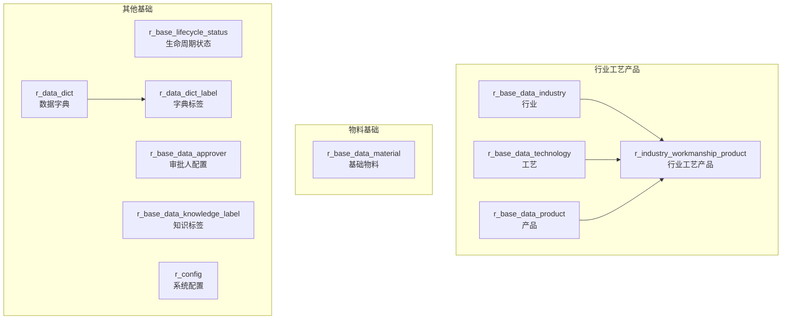

# 基础数据（BaseData）

| 表 | 用途 | 核心外键 |
|---|------|---------|
| r_base_data_industry | 行业 | — |
| r_base_data_technology | 工艺 | — |
| r_base_data_product | 产品 | — |
| r_industry_workmanship_product | 行业工艺产品 | industry_id, technology_id, product_id |
| r_base_data_material | 基础物料 | material_type_id |
| r_base_lifecycle_status | 生命周期状态 | block, stage |
| r_base_data_approver | 审批人配置 | link_id |
| r_base_data_knowledge_label | 知识标签 | — |
| r_data_dict | 数据字典 | — |
| r_data_dict_label | 字典标签 | dict_id |
| r_config | 系统配置 | config_mark |
| r_technology_scheme | 工艺方案 | — |
| r_technology_scheme_device | 工艺方案设备 | technology_scheme_id |
| r_cate_area | 地区（省市区） | pid |
| r_error_message_define | 错误码定义 | — |
