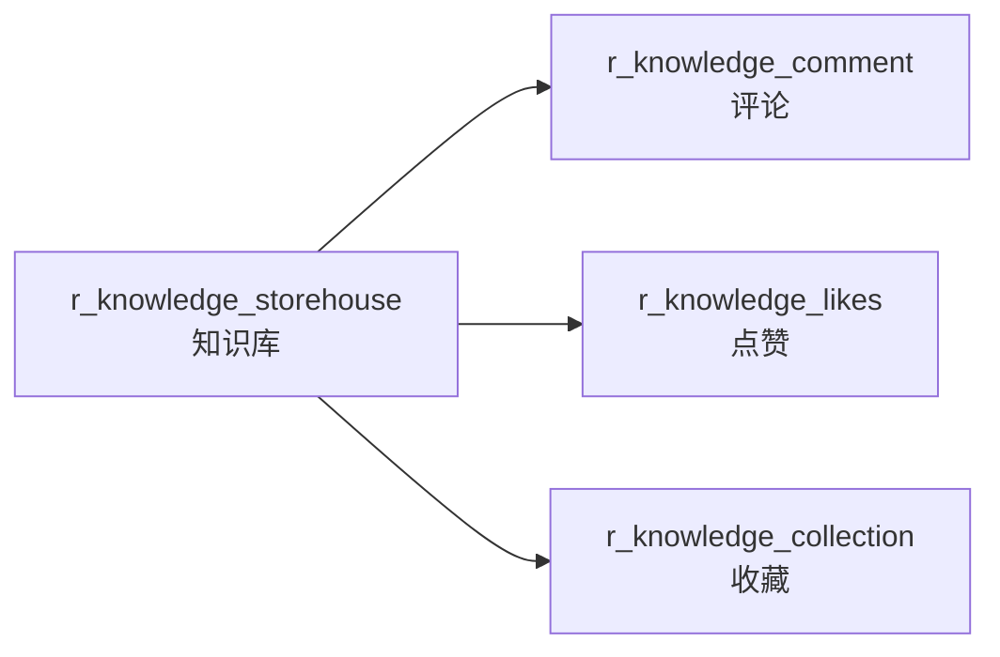

# 知识库（Knowledge）

| 表 | 用途 | 核心外键 |
|---|------|---------|
| r_knowledge_storehouse | 知识库文章 | creator_user_id |
| r_knowledge_comment | 评论 | knowledge_id, user_id |
| r_knowledge_likes | 点赞 | knowledge_id, user_id |
| r_knowledge_collection | 收藏 | knowledge_id, user_id |
