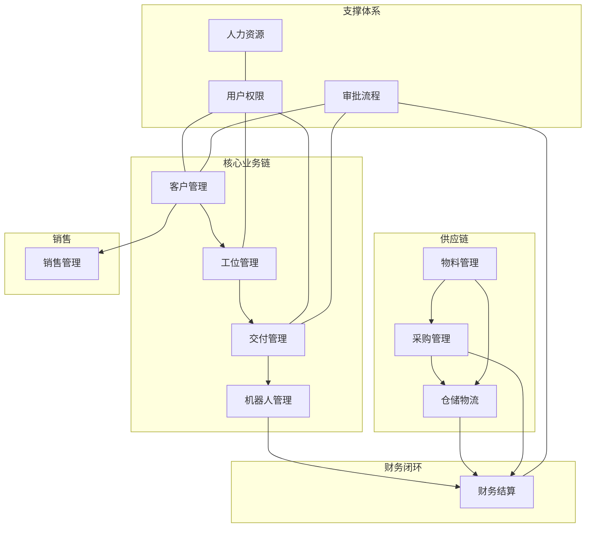

# 数据库表关系索引

> 使用方式：先读此索引确定目标模块，再读取对应文件。不要一次加载全部。

## 模块总览

## 文件索引

| 模块 | 文件 | 核心表 | 典型场景 |
|------|------|--------|---------|
| 用户体系 | [01-user-rbac.md](01-user-rbac.md) | r_user, r_staff, r_company, r_department | 用户/角色/权限查询 |
| 客户管理 | [02-customer-crm.md](02-customer-crm.md) | r_customer, r_customer_clue, r_customer_changdi | CRM线索/跟进/签约 |
| 工位管理 | [03-workstation.md](03-workstation.md) | r_work_station, r_work_station_scheme(+17子表) | 工位方案/需求/模板 |
| 交付管理 | [04-delivery.md](04-delivery.md) | r_delivery_work_order, r_delivery_work_order_task | 交付工单/任务/模拟工位 |
| 机器人管理 | [05-robot.md](05-robot.md) | r_robot, r_robot_data, r_robot_data_settle | 机器人数据/结算/硬件 |
| 物料管理 | [06-material.md](06-material.md) | r_material, r_material_stock, r_material_request_order | 物料库存/请购/退料 |
| 采购管理 | [07-purchase.md](07-purchase.md) | r_purchase_order, r_purchase_into_storage_order | 采购订单/入库/退货 |
| 销售管理 | [08-sale.md](08-sale.md) | r_sale_order, r_sale_order_return | 销售订单/退货 |
| 仓储物流 | [09-warehouse.md](09-warehouse.md) | r_storehouse, r_transfer_order, r_inventory_order | 库房/调拨/盘点 |
| 财务结算 | [10-finance-settlement.md](10-finance-settlement.md) | r_post_statement, r_daily_settlement, r_month_settlement | 对账单/日结/月结/付款 |
| 异常报告 | [11-abnormal-report.md](11-abnormal-report.md) | r_abnormal_report, r_rectification_report | 异常报告/检讨/评审/申诉 |
| 图表报表 | [12-charts-bi.md](12-charts-bi.md) | r_charts_board, r_charts_group | BI看板/工作台/小看板 |
| 审批流程 | [13-workflow.md](13-workflow.md) | r_matter_approve, r_matter_backlog | 审批/待办/抄送 |
| 人力资源 | [14-hr.md](14-hr.md) | r_hr_employee, r_hr_department, r_attendance | HR员工/考勤 |
| 基础数据 | [15-base-data.md](15-base-data.md) | r_data_dict, r_base_data_industry, r_config | 字典/行业/工艺/配置 |
| 知识库 | [16-knowledge.md](16-knowledge.md) | r_knowledge_storehouse, r_knowledge_comment | 知识文章/评论/点赞 |
| 系统工具 | [17-system-tools.md](17-system-tools.md) | r_upload_file, r_menu, r_archives | 文件/菜单/日志/缓存 |

## 跨模块关联提示

常见跨模块查询场景：
- **客户→工位→交付→结算**：读 02→03→04→10
- **物料→采购→仓储→财务**：读 06→07→09→10
- **机器人→工位→结算**：读 05→03→10
- **客户→销售→仓储**：读 02→08→09
